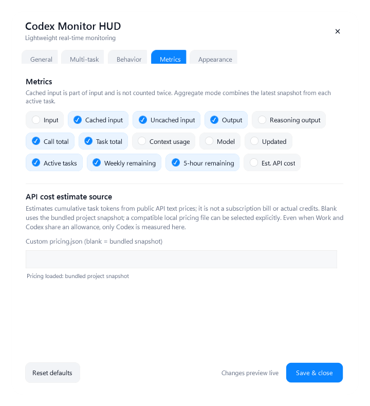

# Codex Monitor HUD

> [简体中文](README.zh-CN.md) · Windows x64 only

Codex Monitor HUD is a local, real-time Windows overlay for the Codex Desktop tasks that are active now. It is deliberately a monitor, not a chat archive, billing dashboard, or cloud service.

## Install with one short prompt

Give Codex this repository URL and say: **“Install this for me.”**

The repository includes [INSTALL_WITH_CODEX.md](INSTALL_WITH_CODEX.md) and [install-manifest.json](install-manifest.json). A capable agent can detect Windows x64, select a verified Release when one is available, preserve settings, health-check the installation, and retain a rollback copy. It must not inspect conversation text to install the HUD.

Manual installation:

```powershell
powershell.exe -NoProfile -ExecutionPolicy Bypass -File .\scripts\install.ps1
```

## What you see

- Active, listening, idle, paused, read-error, completed, and aborted task state.
- Cached / uncached input, output, reasoning output, per-call and per-task totals, context usage, model, and task count.
- Latest observed account-wide weekly and 5-hour allowance windows when Codex writes them to the local `rate_limits` record.
- Stable task numbers, workspace labels, and the official local conversation title from `session_index.jsonl`.
- Optional API-list-price equivalent cost estimate, clearly marked as an estimate rather than a subscription bill or credit balance.


The weekly and 5-hour values are not guessed, summed across tasks, or fetched from an account API. They show the newest local observation only. If the installed Codex version does not emit a window, the enabled metric shows `--`.

## Display modes

| Mode | Use |
| --- | --- |
| Summary | A compact aggregate bubble. |
| List | Stable numbered task rows inside the main HUD; rows, cards, and rail styles are available. |
| Split | Independent, resizable task bubbles (up to 12), backed by the same bounded task table. |

The aggregate count button is only a list expand/collapse control. If task bubbles have been detached, collapsing the list leaves those independent bubbles open. Use **Merge all task bubbles** from the HUD or tray menu when you actually want to merge them.



## Everyday controls

- Click the task count to expand or retract the embedded list.
- Detach one task, or choose **Split all** from the HUD or notification-area menu.
- Drag the main HUD to a custom position; double-click it to open Settings.
- Dismiss only removes a task from the current HUD view. It returns when that conversation starts another turn.
- Set opacity anywhere from **0% to 100%**. At 0% the overlay is intentionally invisible; use the notification-area menu or settings shortcut to recover it.
- If mouse click-through is enabled, use the notification-area menu or ask Codex to disable it.

## Privacy and limits

All processing stays local. The HUD reads only the bounded data needed to project current state: usage counters, model, lifecycle events, workspace leaf, session ID, and official local title. It does not store prompts, replies, tool output, raw transcripts, or credentials; it does not modify Codex session files; it has no telemetry or network calls.

Task discovery is capped at 64 recent session files. Reopened conversations are selected by recent write time, and internal/subagent sessions plus expired terminal tasks are excluded from the user-visible projection.

See [PRIVACY.md](PRIVACY.md) and [SECURITY.md](SECURITY.md) for the data boundary.

## Platform support

- **Windows 10/11 x64:** supported and packaged.
- **macOS / Linux / other architectures:** no binary, installer, workflow, or support promise is provided.

macOS support has been intentionally dropped from this project. macOS users are welcome to adapt the public source on their own machines, but this repository ships and validates Windows only.

## Development and release preparation

```powershell
powershell.exe -NoProfile -ExecutionPolicy Bypass -File .\scripts\build-dotnet.ps1 -RunRuntimeTests
powershell.exe -NoProfile -ExecutionPolicy Bypass -File .\scripts\test.ps1
powershell.exe -NoProfile -ExecutionPolicy Bypass -File .\scripts\prepare-release.ps1
```

The installed build carries its own private .NET runtime. Source development requires Windows PowerShell 5.1+, Node.js for the plugin host, and the repository toolchain.

Release operators can use [GITHUB_RELEASE_DRAFT_2.2.0.md](GITHUB_RELEASE_DRAFT_2.2.0.md) for copy-ready commit text, the Release body, asset names, checksum handling, and the final upload checklist.

## Project status

`2.2.0` is a Windows x64 release candidate. The resident host is compiled .NET/WPF, while the Settings process and `-Legacy` fallback remain available for recovery. This is an unofficial, independent project and is not affiliated with or endorsed by OpenAI.

MIT License.
