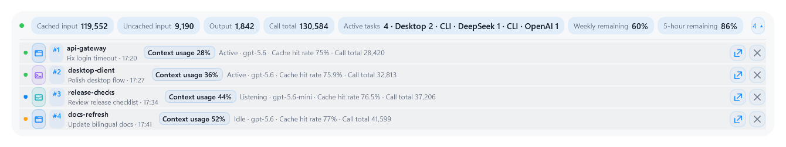

# Codex Monitor HUD

> English · [简体中文](README.zh-CN.md)

## Install with Codex

Give Codex only this repository URL plus “install this.” The agent must follow the short, deterministic [INSTALL_WITH_CODEX.md](INSTALL_WITH_CODEX.md) procedure and `install-manifest.json`; it must not inspect conversation content or improvise install commands.

Codex Monitor HUD is a Windows desktop overlay for monitoring currently active Codex Desktop tasks. It reads a bounded subset of local Codex session records and projects that state as a summary, an expandable task list, or independent task bubbles.

The project is intentionally a live monitor, not a historical analytics service, billing tool, or conversation database.

## What it shows

- active, listening, idle, paused, read-error, completed, and aborted states;
- cached and uncached input, output, reasoning output, call total, task total, and context use;
- the latest weekly-allowance observation present in local Codex records;
- stable task numbers and a two-line task identity;
- optional public-API-equivalent cost estimates, clearly labeled as estimates.

Each task-list item has a project/workspace main title and a subtitle line. The default hover mode keeps the time visible and reveals the official Codex conversation title on hover. `Always` keeps the conversation title visible; `Hidden` keeps only the project and time. Titles come from Codex's local `session_index.jsonl`, not from prompt or response text.

## Display modes

| Mode | Behavior |
| --- | --- |
| Summary | One compact aggregate HUD; no per-task windows. |
| List | Stable numbered rows inside the main HUD. Styles: rows, cards, and rail. Detail: Compact, Balanced, or Detailed. |
| Split | Up to 12 independent, resizable task bubbles backed by the same session-state table. |

Task discovery is capped at 64 recent session files. Reopened conversations are found by recent write time even when their files remain under an older creation-date folder. Internal/subagent sessions and expired terminal tasks are filtered from the user-visible projection.



## Optional behavior

These features are disabled by default and should be enabled deliberately:

- double-click a task row or bubble to open its validated `codex://threads/<id>` deep link;
- retract a quiet HUD to one overall light or numbered horizontal/vertical task lights;
- automatic completion, abort/error, settling, and context-threshold reminders;
- proactive, task-targeted Codex notices with text-only or bounded expressive permission;
- mouse click-through, with recovery from the notification-area menu and settings shortcuts;
- API-equivalent cost estimates and imported local themes.

The HUD does not infer completion from prose. Completed and aborted states require lifecycle evidence; an activity timeout becomes idle rather than a false completion.

## Codex Micro color reference

The optional `codexMicro` scheme uses five display-reference values sampled from OpenAI's public Codex Micro page. It is not an official OpenAI HUD palette, does not imply endorsement, and is not calibrated to reproduce the page or hardware lighting. Display, color-management, accessibility, and theme differences can change the visible result. See [COLOR_ATTRIBUTION.md](COLOR_ATTRIBUTION.md) for the source, values, mapping, and limitations.

## Runtime and performance boundary

The `2.2.0` Windows line moves the resident monitor into a compiled .NET host while retaining the WPF/Windows Forms/Win32 shell, on-demand compatible Settings process, and `-Legacy` recovery path. Platform-neutral parsing, bounded discovery, incremental JSONL reading, state transitions, configuration, pricing, and presentation rules live in `CodexMonitorHud.Core`.

Normal file-change events poll only the affected paths. Full discovery is reserved for structural changes, watcher overflow, and periodic reconciliation; unchanged lifecycle ticks do not stat every tracked file. Initial tails and appended records are bounded, and retained WPF controls are updated in place when their structure is unchanged.

## Privacy

Processing is local. The HUD:

- reads only the top-level usage, model, lifecycle, workspace leaf, session ID, and official local title needed for display;
- does not store prompts, assistant messages, tool output, raw transcripts, or credentials;
- does not write to Codex session files;
- makes no network requests and has no telemetry;
- keeps the MCP task registry limited to task number, workspace leaf, coarse status, and update time.

See [PRIVACY.md](PRIVACY.md) and [SECURITY.md](SECURITY.md).

## Requirements

- Windows 10 or Windows 11;
- Codex Desktop with local session records available;
- no machine-wide .NET installation is required by an installed build; the installer stages a private runtime;
- Windows PowerShell 5.1 or later for the exact-compatible Settings host and emergency legacy fallback;
- Node.js available to the Codex plugin host.

## Platform status

- **Windows x64:** supported by this release line.
- **Other operating systems and architectures:** not included in `2.2.0`.

macOS work is deliberately deferred until interactive real-device validation is available; it is not part of this Windows Release.

## Manual install

```powershell
powershell.exe -NoProfile -ExecutionPolicy Bypass -File .\scripts\install.ps1
```

Manual first install defaults to English. The installer validates before switching, preserves settings, retains rollback material, and does not enable Windows login startup.

## Everyday controls

- Click the task count to open or close the list.
- Detach one task or use **Split all** from the HUD/tray menu.
- Drag the main HUD to use a custom position.
- Double-click the main HUD to open Settings.
- If click-through is enabled, use the notification-area icon to disable it.
- Dismissing a row or bubble affects only the current HUD view; the task returns on its next turn.

Settings are stored at `%LOCALAPPDATA%\CodexMonitorHUD\settings.json` and are not packaged with the plugin.

## Token accounting

```text
uncached input = input tokens - cached input tokens
call total     = input tokens + output tokens
```

Reasoning output is an output detail and is not added to call total a second time. Weekly allowance is a latest local observation, not a direct account query. Cost estimates use local pricing data and are not subscription bills, charges, or exact credit conversions.

## Development

```powershell
powershell.exe -NoProfile -ExecutionPolicy Bypass -File .\scripts\build-dotnet.ps1
powershell.exe -NoProfile -ExecutionPolicy Bypass -File .\scripts\test-dotnet.ps1
powershell.exe -NoProfile -ExecutionPolicy Bypass -File .\scripts\test.ps1
powershell.exe -NoProfile -ExecutionPolicy Bypass -File .\scripts\test-runtime-isolated.ps1 -HostMode compiled -Mode list -TaskCount 5
powershell.exe -NoProfile -ExecutionPolicy Bypass -File .\scripts\test-runtime-isolated.ps1 -HostMode compiled -Mode split -TaskCount 5
powershell.exe -NoProfile -ExecutionPolicy Bypass -File .\scripts\compare-runtime-performance.ps1 -TaskCount 12 -ChurnCycles 1
powershell.exe -NoProfile -ExecutionPolicy Bypass -File .\scripts\test-behavior-isolated.ps1
```

Tests use synthetic sessions and isolated state roots. See [Architecture](docs/ARCHITECTURE.md), [Project status](docs/PROJECT_STATUS.md), [Test results](TEST_RESULTS.md), and [Contributing](CONTRIBUTING.md).

## Project status and disclaimer

The current Windows release candidate is `2.2.0`. It is a local-first, unofficial project and is not affiliated with or endorsed by OpenAI.

MIT License.
