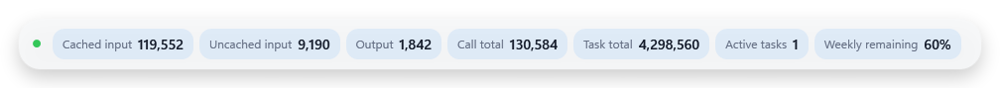
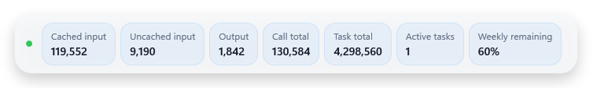
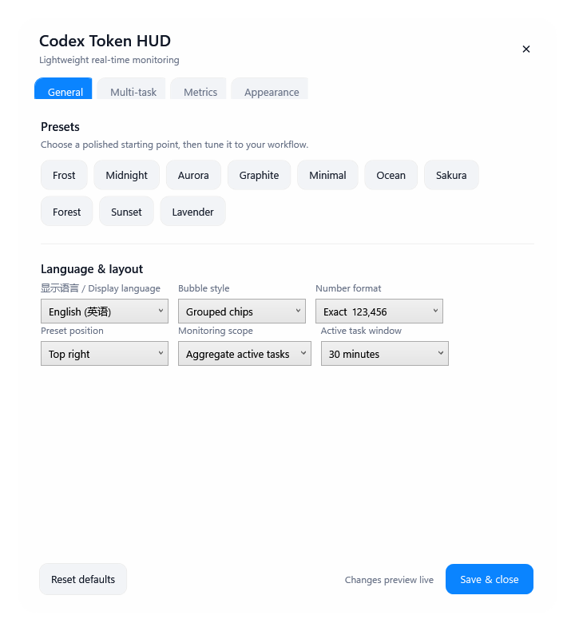
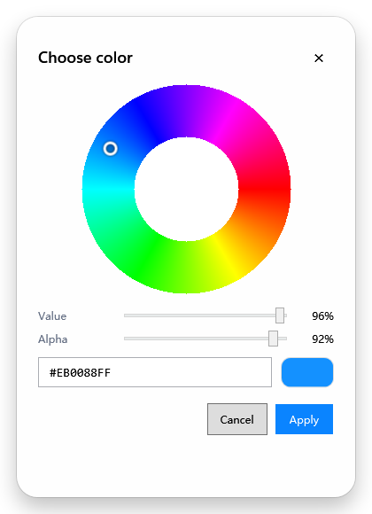
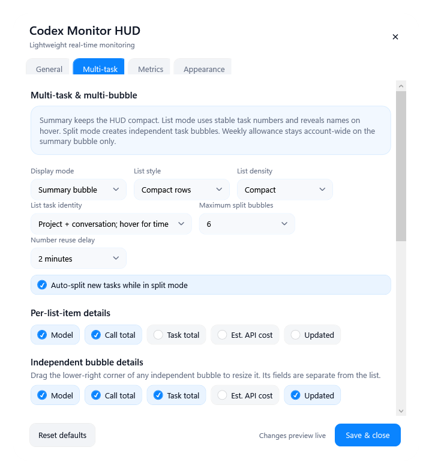
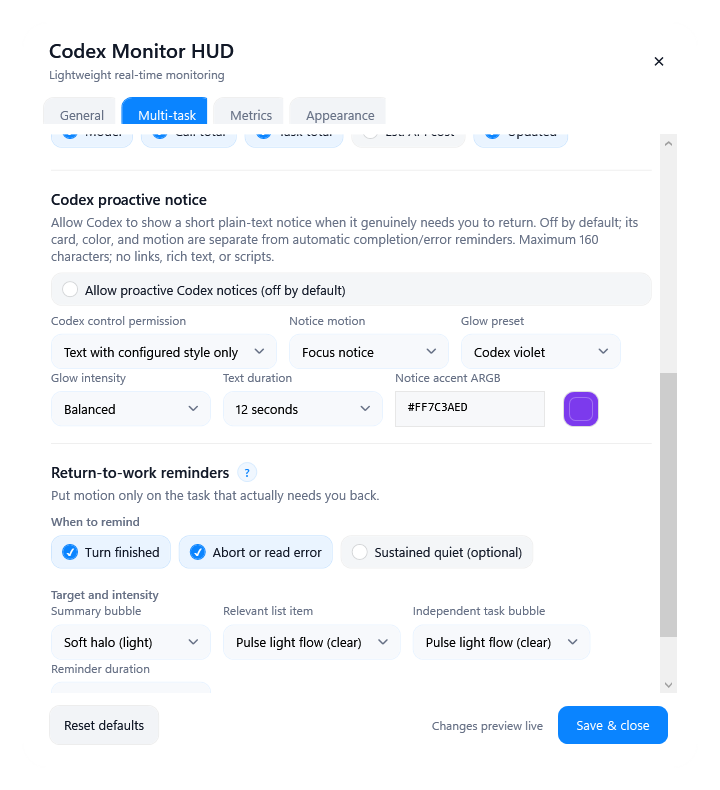
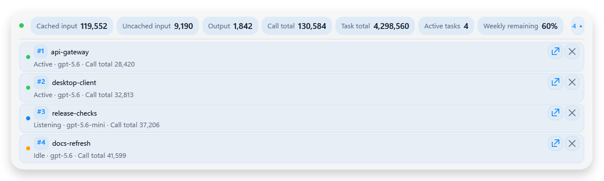
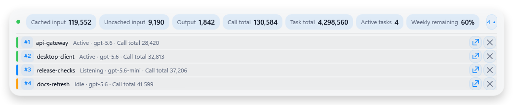

# Codex Monitor HUD

> You are reading: **English** · [阅读简体中文版 →](README.zh-CN.md)

**Know when Codex needs you—without keeping Codex in front.**

Codex Monitor HUD is a lightweight, always-visible real-time task monitor for Codex Desktop on Windows. Leave Codex working in the background while you watch a video, play a game, write, browse, or work in another app. A small desktop HUD keeps the live state of your Codex tasks in sight and draws your attention back only when something needs it.

> **Safety reminder:** do not close a Codex conversation while it is still running. If you accidentally click its close button, restart Codex (and the HUD if needed) before judging the monitor state; the deleted-conversation recovery path is intentionally conservative.

It is built for one job: **reliable live awareness of background Codex work**. Token counters and the latest locally observed weekly allowance provide useful context, but they are not the product's identity. This is not a historical analytics suite, billing dashboard, or conversation index.

## Who it is for

Codex Monitor HUD is especially useful when you:

- let Codex run long tasks while another app is in the foreground;
- run several Codex tasks concurrently and need to see which one is active, settled, completed, or interrupted;
- want a compact visual reminder instead of repeatedly reopening Codex;
- care about fast refresh, low overhead, local processing, and a UI that can stay on screen for hours;
- want task-level live context without maintaining another usage database.

## Monitor now, analyze later

| Your main need | Better fit |
|---|---|
| Keep background Codex tasks visible in a small always-on-top HUD | **Codex Monitor HUD** |
| See concurrent tasks as one summary, a list, or separate bubbles | **Codex Monitor HUD** |
| Get a visible return-to-work cue when a task settles, completes, or fails | **Codex Monitor HUD** |
| Investigate historical usage by task, model, subagent, call, or time range | [Codex Usage Tracker](https://github.com/douglasmonsky/codex-usage-tracker) |
| Use a local SQLite index, dashboard, CLI reports, or deeper usage diagnostics | [Codex Usage Tracker](https://github.com/douglasmonsky/codex-usage-tracker) |

[Codex Usage Tracker](https://github.com/douglasmonsky/codex-usage-tracker) is a strong local-first choice when you want detailed analysis after or across runs. It intentionally offers a broader dashboard, index, CLI, and investigation workflow. Codex Monitor HUD stays focused on the lighter, immediate question: **what is Codex doing right now, and do I need to return?** This project's maintainer has also contributed a reviewed and merged pull request to Codex Usage Tracker with Simplified Chinese localization and small performance improvements.

## Three ways to watch concurrent work

- **Summary** — the default. One compact bubble shows the combined live picture without task names.
- **Task list** — expand the HUD into stable numbered rows. Choose compact rows, information cards, or a status rail; tune the density separately. Every row shows `project · short conversation label` by default, so parallel conversations inside one project remain distinguishable. Hover adds the start time; project-only and always-show-time modes remain available.
- **Split bubbles** — detach one important task or split all visible tasks into independent, resizable bubbles. Merge one task or everything back into the summary at any time.

Each list row and independent bubble also has a restrained × action for manual cleanup. It removes only that item from the current HUD view—never the Codex conversation or log—and the item returns automatically if the same conversation starts another turn.

List fields and independent-bubble fields are configured separately. The latest weekly allowance observation is account-wide, so it remains on the summary rather than being repeated as if every task had its own allowance.

Rapid task churn is bounded and predictable: visible tasks keep their numbers, released numbers cool down before reuse, expired or externally deleted state is removed, and reopened older conversations are rediscovered by recent write time in their original creation-date folders instead of replacing newer rows. When no visible task remains, the HUD reports that directly instead of waiting forever for a vanished conversation. Session discovery is capped at 64 active files, and independent bubbles are hard-capped at 12. These guardrails protect long-running, high-concurrency use without turning the monitor into another indexing service.


## Attention that points to the right task

Codex Monitor HUD distinguishes ordinary live activity from moments that may need you. Status-dot reminders and surface reminders are independent and can run together:

- status-dot rhythm, brightness, speed, and optional subtle scale breathing;
- soft halo, whole-surface breathing, moving pulse light, or a stronger focus pulse;
- separate behavior for the summary, the relevant list row, and an independent task bubble;
- separate switches for explicit completion, abort/error, and natural settling.

The monitor does not guess beyond the local evidence it can observe. **Completed** and **aborted** require explicit lifecycle events. A normal activity timeout becomes **settled/idle**, not a false completion.

### Optional: let Codex call you back mid-turn

Alongside automatic state reminders, the HUD has a **separately authorized, off-by-default** proactive Codex notice channel. A developer or user can define a policy such as “notify me when a decision, approval, manual inspection, or named milestone needs attention.” Codex can send a short, unmistakably **CODEX NOTICE** message and then continue the same task; the turn does not have to end first.

- Each new Codex task rediscovers the capability from the plugin tool list instead of relying on another conversation's memory. Tasks already open during an install or upgrade may need to be recreated, or Codex restarted.
- Codex first reads whether permission is off, text-only, or expressive, plus privacy-safe active task numbers.
- Summary mode includes the source task number. List and split modes show text and motion only on the matching task. If targeting is ambiguous, Codex should ask instead of guess.
- Text-only permission uses the user's configured notice style. Expressive permission lets Codex compose glow, pulse, breathe, flow, tempo, direction, and intensity in real time.
- Choreography is bounded declarative visual data, never executable model-supplied code. Notices reject links and rich text and are capped at 160 characters.

Notice color, glow preset, strength, duration, and default motion are configured separately from automatic completion/error reminders. The channel is an attention cue, not a replacement for normal replies and not a way to manufacture task status.

## Designed to stay out of the way

- Local incremental reads instead of a second usage database.
- Summary mode creates no per-task windows; list rows render only while expanded.
- Fast bounded discovery and stale-state cleanup for long-running use.
- Starts with the Codex plugin lifecycle, not Windows login.
- Optional mouse click-through, disabled by default, with recovery from the persistent notification-area icon, settings shortcuts, and Codex.
- Uniform, layered-clarity, and smart-focus transparency modes. Important values can remain readable while the shell and secondary details fade further.
- Always-on-top positioning, six bubble layouts, ten visual presets, and opacity down to 15%.

## Screenshots

| Grouped chips | Metric cards |
|---|---|
|  |  |

| Settings | HSV / ARGB color picker |
|---|---|
|  |  |

| Multi-task controls | Proactive Codex notice and automatic reminders |
|---|---|
|  |  |

| Information-card list | Status-rail list |
|---|---|
|  |  |

All screenshots use synthetic task names, Token values, and allowance values. They contain no real logs, prompts, account data, or conversation content.

## Live information

Depending on the selected view and fields, the HUD can show:

- active, listening, idle, paused, error, completed, and aborted states;
- active task count, stable task number, project/conversation identity, model, and update time;
- cached input, fresh input, output, reasoning output, call total, and task total;
- context pressure and the latest weekly remaining allowance observed in local Codex records.
- an opt-in cumulative **estimated API-equivalent cost** for the summary, each list row, and each independent bubble.

The weekly allowance value is a recent local observation, not a direct account API query. It may lag behind another Codex surface until a newer local record is written.

The cost figure is deliberately labeled as an estimate. It applies public text-token API prices to cumulative Codex input, cached input, and output tokens; it is **not** a ChatGPT subscription bill, an actual charge, or an exact credit conversion. Subscribers can use it as a rough view of Codex usage scale and API-equivalent value—plus the small satisfaction of seeing that today's subscription earned its keep. [OpenAI currently states](https://help.openai.com/en/articles/20001275/) that Codex, ChatGPT Work, ChatGPT for Excel, and Workspace Agents can draw from the same agentic usage/credit pool when available on a plan. This HUD sees only local Codex session records, so it cannot measure or separate Work usage and cannot reconstruct the full shared pool.

Pricing is local and updateable: the project uses its bundled snapshot by default, so no other application or user folder is required. A custom JSON using the `codex-usage-tracker-pricing-v1`-compatible schema can be selected explicitly in Metrics. No pricing request is made while the HUD runs; unknown models show `--` instead of a guessed value, and the UI never displays the full local path.


## Appearance and interaction

- Simplified Chinese, English, and symbol-only HUD labels. Language and recovery entries stay bilingual.
- Six bubble layouts: grouped chips, compact chips, inline minimal, outlined chips, metric cards, and stacked cards.
- Three task-list styles and three density levels.
- Ten data-driven visual presets plus per-state ARGB color editing.
- A drag-and-drop Theme Workshop for `.json` / `.cmhud-theme` files and `.cmhud-theme.zip` packs with local PNG/JPG artwork. Themes can control gradients, typography, shadows, borders, status-dot scale, list density, and reminder appearance without executing theme code.
- Exact, compact, and automatic number formatting.
- Font size in 0.1-point steps, radius, opacity, scale, position, field selection, and update animation.
- Drag to move, double-click for settings, and right-click for display and lifecycle controls.
- Notification-area controls remain available while click-through is enabled.

Basic built-in presets focus on appearance. Rich themes may intentionally carry visual layout, density, and reminder styling, but cannot alter reminder triggers, monitored data, or privacy behavior. See [Themes and UI extension points](docs/THEMING_AND_UI_EXTENSIONS.md), invoke [`$create-monitor-hud-theme`](skills/create-monitor-hud-theme/SKILL.md) to make a shareable theme, or read the [AI customization and porting guide](docs/AI_PORTING_AND_CUSTOMIZATION_GUIDE.md) before a deep modification, macOS/Linux port, or Claude Code adapter.

## Install with Codex

Copy this repository's GitHub URL and paste it into Codex with the following prompt:

```text
Install and configure the Codex Monitor HUD plugin from this GitHub repository:

<PASTE_THIS_REPOSITORY_URL_HERE>

Read INSTALL_WITH_CODEX.md first. On Windows, run scripts/install.ps1, validate the
plugin and live local-log parser, enable the personal plugin entry, and open settings.
Do not enable Windows login startup. Do not upload, delete, move, or modify my Codex
session logs, usage databases, prompts, settings, or conversation content. Tell me
clearly if Codex must restart or open a new task before plugin discovery completes.
Keep the first install on basic monitoring defaults. Do not enable proactive notices,
expressive choreography, cost estimates, click-through, or third-party themes for me.
After installation, explain these optional DIY features and let me choose.
```

For a bilingual copy-and-paste prompt and verification checklist, see [INSTALL_WITH_CODEX.md](INSTALL_WITH_CODEX.md).

## Manual install

```powershell
powershell.exe -NoProfile -ExecutionPolicy Bypass -File .\scripts\install.ps1
```

Enable `codex-monitor-hud` in the personal plugin marketplace, then restart Codex or open a new task if plugin discovery has not refreshed yet.

The installer creates desktop and Start menu settings shortcuts. It does not enable Windows login startup.

## Everyday use

- Leave **Summary** selected for the smallest always-visible monitor.
- Open the task counter to inspect the task list.
- Detach a task that deserves its own bubble, or choose **Split all** for a parallel-task command center.
- Use the notification-area **Display mode** submenu to switch modes or merge all bubbles.
- If click-through is enabled, use the notification-area icon and choose **Disable click-through** to regain pointer access.
- Ask Codex to “open Codex Monitor HUD settings” after the plugin is loaded.

Settings are stored locally under `%LOCALAPPDATA%\CodexMonitorHUD\settings.json` and are never included in releases.

## Accounting

Cached input is part of input, not an extra bucket:

```text
fresh input = input tokens - cached input tokens
call total  = input tokens + output tokens
```

Reasoning output is shown as an output detail and is not added to the call total again.

## Privacy and limits

Codex Monitor HUD reads the top-level usage, model, minimal lifecycle, and workspace-leaf information needed from recent local Codex sessions. For same-project identification, it follows Codex Usage Tracker's proven approach and reads Codex's separate `session_index.jsonl` to obtain the official `thread_name`; it does not derive titles from prompt text. The title remains runtime-only and is never written to the MCP registry, settings, repository, or a usage index. It does not store prompts, assistant messages, tool output, raw transcripts, or account credentials. It makes no network requests and has no telemetry. See [PRIVACY.md](PRIVACY.md).

Requirements:

- Windows 10 or Windows 11;
- Codex Desktop with local session records available;
- Windows PowerShell 5.1 or later;
- Node.js available to the local Codex plugin host.

Codex Monitor HUD is an independent, unofficial open-source project and is not affiliated with or endorsed by OpenAI.

## Development

```powershell
powershell.exe -NoProfile -ExecutionPolicy Bypass -File .\scripts\test.ps1
```

There are no npm dependencies and no build step. See [ARCHITECTURE.md](docs/ARCHITECTURE.md) and [CONTRIBUTING.md](CONTRIBUTING.md).

## License

MIT
