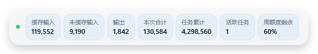
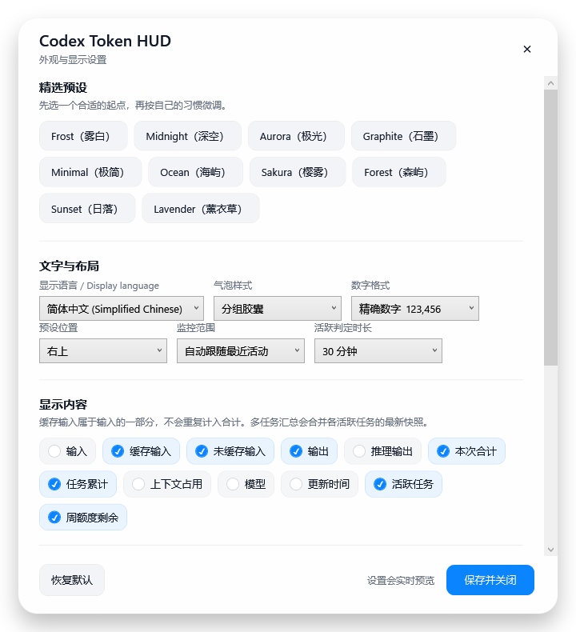
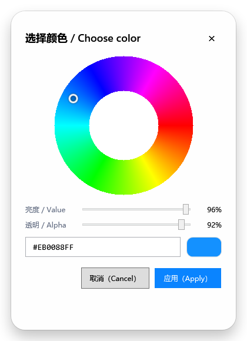

# Codex Token HUD

一个面向 Windows 版 Codex Desktop 的轻量、精致、完全本地运行的 Token 悬浮组件。


## 界面预览

| 分组胶囊 | 独立卡片 |
|---|---|
|  |  |

| 设置页 | HSV / ARGB 颜色选择器 |
|---|---|
|  |  |

截图均使用合成 Token 和周额度数据，不包含真实任务、日志或账号信息。

它直接读取 Codex 已经写在本机日志中的 Token 计数，不需要 API Key、账号授权、云端服务或额外数据库。每个活跃任务都有独立的读取偏移和统计状态，因此同时运行多个 Codex 任务也不会互相覆盖。

## 能显示什么

- 输入总计；
- 缓存输入；
- 未缓存输入，也就是本次新增输入；
- 输出；
- 推理输出；
- 本次调用合计；
- 当前任务累计；
- 可选模型、上下文占用和更新时间。
- 活跃任务数量；
- 自动跟随最近活动的任务，或汇总指定时间窗口内的全部活跃任务。

## 外观与自定义

内置十套可直接使用的预设：

- Frost：克制的雾白玻璃风；
- Midnight：深色半透明；
- Aurora：低饱和渐变；
- Graphite：紧凑石墨风；
- Minimal：纯符号极简显示。
- Ocean、Sakura、Forest、Sunset、Lavender：适合不同明暗和色彩偏好的扩展色系。

还可以自定义：

- 简体中文、English、纯符号；语言入口和右键菜单始终中英双语，避免用户切错语言后找不到入口；
- 六种相互独立的气泡样式：分组胶囊、紧凑胶囊、单行极简、描边胶囊、独立卡片和纵向卡片；
- 需要显示的字段；
- 默认显示本地日志最近观测到的周额度剩余，也可在设置中关闭；
- 精确数字、紧凑数字、智能格式；
- 字号、圆角、透明度、背景色、文字色和强调色；颜色既能用色环选择，也能直接输入 ARGB；
- 六个预设位置或任意拖动位置；
- 状态点、始终置顶和更新动效；状态点会区分活动、监听、空闲、暂停和读取错误；
- 高级状态颜色与时间阈值。

主题和 UI 魔改接口见 [docs/THEMING_AND_UI_EXTENSIONS.md](docs/THEMING_AND_UI_EXTENSIONS.md)。

精选预设只改变配色、圆角和透明度等视觉属性，不会再重置气泡样式、数字格式或显示字段。

## 最简单的安装方法

把本仓库的 GitHub 链接复制下来，与下面这段话一起粘贴到 Codex：

```text
请安装并配置这个 GitHub 仓库中的 Codex Token HUD 插件：

<在这里粘贴仓库链接>

请先阅读 INSTALL_WITH_CODEX.md。Windows 下运行 scripts/install.ps1，完成插件复制、
个人插件市场登记、结构校验、实时日志读取测试并打开设置窗口。不要设置 Windows 登录
自启动；应由 Codex 插件生命周期启动。不要上传、删除或修改我的 Codex 日志、使用统计
数据库、提示词或会话内容。如果需要重启 Codex 或新建任务才能发现插件，请明确告诉我。
```

完整说明见 [INSTALL_WITH_CODEX.md](INSTALL_WITH_CODEX.md)。

## 使用

- 拖动悬浮条：调整位置；
- 双击：打开设置；
- 右键：暂停、恢复、重置位置或退出；
- 插件加载后，也可以直接对 Codex 说“打开 Token HUD 设置”。
- 安装器会创建桌面和开始菜单设置快捷方式；无需找脚本，也不会设置开机自启动。
- “自动跟随最近活动”适合关注当前操作；“汇总所有活跃任务”适合同时运行多个任务。

设置文件位于 `%LOCALAPPDATA%\CodexTokenHUD\settings.json`。

## 统计口径

缓存输入是输入的一部分，不能重复相加：

```text
未缓存输入 = 输入总计 - 缓存输入
本次合计   = 输入总计 + 输出
```

推理输出属于输出明细，不会再次加入合计。

## 隐私

插件只读取 `~/.codex/sessions` 中顶层的 `token_count` 与 `turn_context` 记录，不保存对话正文，也不上传日志。详见 [PRIVACY.md](PRIVACY.md)。

## 许可证

MIT
