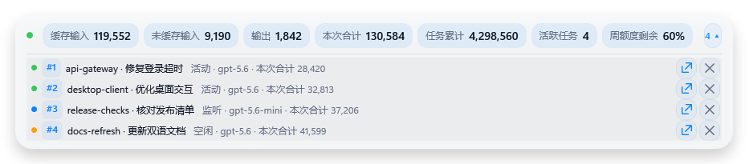
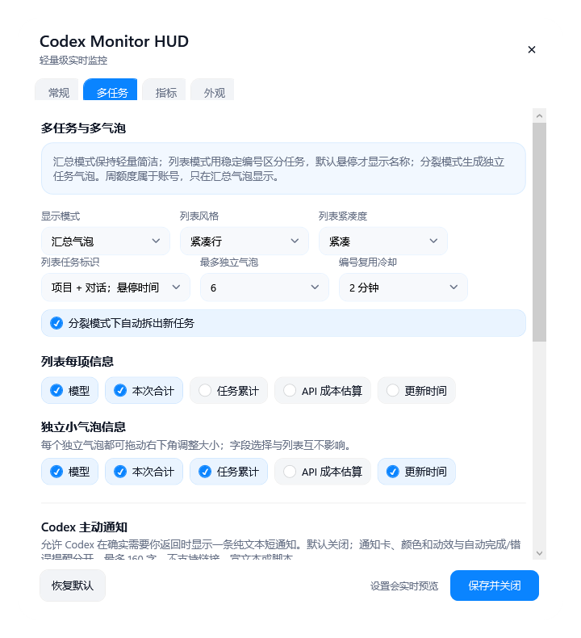
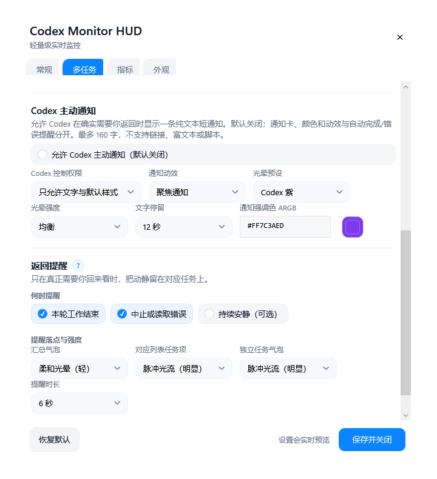
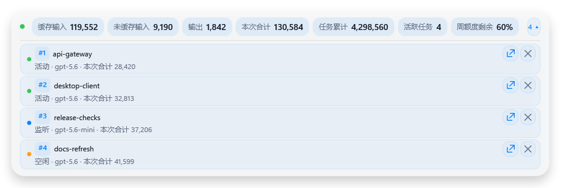
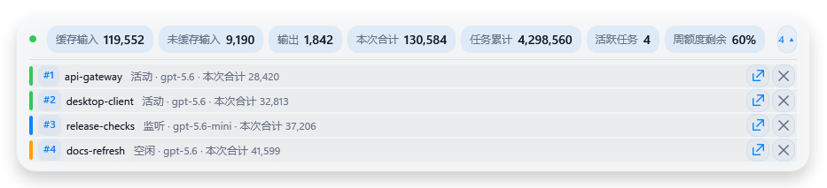
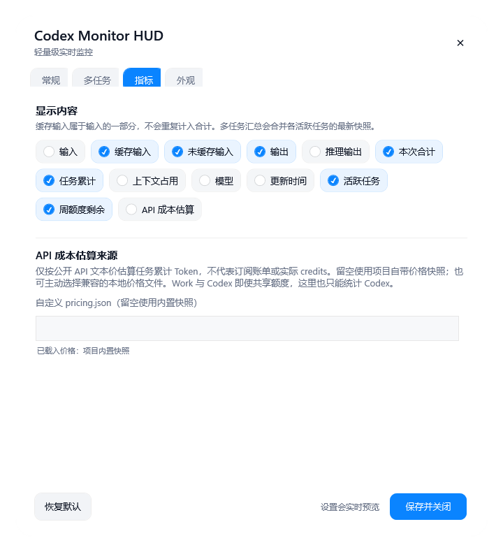

# Codex Monitor HUD

> 当前正在阅读：**简体中文** · [Read in English →](README.md)

**不用把 Codex 一直放在眼前，也能知道它何时需要你。**

Codex Monitor HUD 是面向 Windows 版 Codex Desktop 的轻量级、常驻桌面的实时任务监控 HUD。让 Codex 在后台自己跑任务，你可以在前台看视频、打游戏、写文档、浏览网页或处理其他工作；桌面上只留下一个小气泡，持续告诉你 Codex 还在做什么，并在真正需要你回来时把注意力引到正确的任务上。

> **使用提醒：** Codex 对话还在运行时不要手滑点叉。如果误关了正在运行的对话，先重启 Codex（必要时也重启 HUD），再判断监控状态；删除中的对话恢复路径目前会保持保守处理。

它只专注做好一件事：**稳定、灵敏地守候后台运行的 Codex 任务**。Token 数据和本地最新观测到的周额度只是辅助判断任务情况的上下文，不再是产品名称和定位的中心。它不是历史统计套件、账单面板，也不会给对话建立另一套索引。

## 它适合谁

如果你有下面这些使用习惯，这个 HUD 就是为你准备的：

- 经常让 Codex 长时间在后台运行，前台同时使用其他软件；
- 同时开启多个 Codex 任务，需要知道谁正在工作、已经安静、明确完成或发生中断；
- 不想反复切回 Codex 查看进度，只想在桌面上一眼确认；
- 在意刷新速度、长期稳定、低占用、本地处理和适合常驻的外观；
- 想看到逐任务实时状态，但不想维护另一套用量数据库。

## 实时守候与事后分析，各自解决不同问题

| 你的主要需求 | 更适合的项目 |
|---|---|
| 用一个常驻顶层的小气泡看住后台 Codex 任务 | **Codex Monitor HUD** |
| 把并发任务显示成汇总、列表或多个独立气泡 | **Codex Monitor HUD** |
| 任务安静、完成或失败时得到明确的返回工作提醒 | **Codex Monitor HUD** |
| 按任务、模型、子代理、调用或时间范围深入分析历史用量 | [Codex Usage Tracker](https://github.com/douglasmonsky/codex-usage-tracker) |
| 使用本地 SQLite 索引、仪表盘、CLI 报表和深度诊断 | [Codex Usage Tracker](https://github.com/douglasmonsky/codex-usage-tracker) |

如果你更需要任务完成后的全面分析，可以使用 [Codex Usage Tracker](https://github.com/douglasmonsky/codex-usage-tracker)。它同样坚持本地优先，但有更完整的仪表盘、索引、命令行和调查工作流。Codex Monitor HUD 则刻意保持轻量，只回答眼前最重要的问题：**Codex 现在在做什么，我是否该回去看看？** 本项目维护者也曾向 Codex Usage Tracker 提交过一项经过代码审查并已合并（merged）的 Pull Request，内容包括简体中文本地化和小幅性能优化。

## 三种方式看住并发任务

- **汇总模式**：默认模式。只显示一个紧凑气泡，提供整体实时情况，不显示任务名称；
- **任务列表**：把 HUD 展开成带稳定编号的逐任务列表。可选择紧凑行、信息卡片或状态轨道，并单独调整列表密度。每行默认显示“项目 · 对话短标签”，同一项目里的多个对话也能分清；悬停再显示开始时间，也可改成始终显示时间或仅显示项目；
- **独立气泡**：可以只拆出一个重要任务，也可以一次拆出全部可见任务。每个气泡都能独立缩放、单独合并，也能随时全部收拢回汇总模式。

每个列表行和独立气泡都有一个克制的 × 清理按钮。它只把该任务移出当前 HUD，不会删除 Codex 对话或日志；同一对话以后再次开始新一轮任务时会自动重新出现。

列表字段和独立小气泡字段分开配置。周额度是账号级信息，因此只保留在汇总气泡，不会重复显示成仿佛每个任务都有一份独立额度。

面对任务不停开启、结束的高并发场景，行为依然有边界且可预测：正在显示的任务不会突然换号；释放后的编号会冷却再复用；过期或被外部删除的状态会回收；重新打开的旧对话会按最近写入时间从原创建日期目录重新发现，不会与新对话互相顶替；当没有可见任务时，HUD 会直接说明，不再为已消失的对话永久等；活跃文件发现上限为 64；独立气泡硬上限为 12。这些保护让 HUD 能长期运行，又不会膨胀成另一套历史索引服务。



## 把提醒落在真正需要关注的任务上

Codex Monitor HUD 会区分普通活动和可能需要你介入的时刻。状态点提醒与气泡区域提醒是两条互不冲突、可以叠加的通道：

- 状态点可单独设置闪烁节奏、亮度、速度和轻微缩放呼吸；
- 气泡区域可选择柔和光晕、整体呼吸、脉冲光流或更明显的强聚焦脉冲；
- 汇总气泡、对应列表项和独立任务气泡可以分别选择提醒方式；
- 明确完成、中止/错误和自然安静下来可以分别开关。

HUD 不会超出本地证据乱猜状态。只有明确的生命周期事件才会显示为**已完成**或**已中止**；普通活动超时只会回到**安静/空闲**，不会被误报成任务完成。

### 可选：让 Codex 在工作中途主动叫你

自动状态提醒之外，还有一条**默认关闭、单独授权**的 Codex 主动通知通道。开发者或用户可以提前告诉 Codex“遇到需要决策、审批、人工检查或指定里程碑时通知我”。Codex 发出一条带有醒目 **CODEX 通知**标识的短消息后会继续当前任务，不需要先结束本轮工作。

- 每个新 Codex 任务从插件工具清单重新发现能力，不依赖其他对话的记忆；安装或升级后，已经打开的旧任务可能需要重建或重启 Codex；
- Codex 会先只读查询当前是关闭、仅文字，还是允许安全动态编排，并取得不含对话正文的活动任务编号；
- 汇总模式显示通知来源编号；列表或独立气泡只让匹配的那一个任务显示文字和动效；任务不明确时应询问，而不是猜；
- “仅文字”权限只使用用户设置的通知样式；“动态编排”权限允许 Codex 实时组合光晕、脉冲、呼吸、光流、节奏、方向和强度；
- 所有编排都是有硬上限的声明式视觉数据，不执行脚本、不接受链接或富文本，消息最多 160 字。

主动通知的颜色、光晕预设、强度、停留时间和默认动效与自动完成/错误提醒分别配置。它适合“叫人回来看看”，不应替代正常回复，也不会擅自改变任务状态。

## 轻量化不是口号，而是运行边界

- 增量读取本地记录，不建立第二套用量数据库；
- 汇总模式不创建逐任务窗口，列表只在展开时渲染任务项；
- 活跃发现和过期回收都有明确上限，适合长时间挂着；
- 跟随 Codex 插件生命周期启动，不设置 Windows 登录自启动；
- 鼠标穿透默认关闭；开启后仍可从常驻托盘图标、设置快捷方式或 Codex 恢复；
- 统一透明、分层清晰、智能聚焦三种透明方式，让外壳和次要信息更淡，同时保住关键数字；
- 支持始终置顶、六种气泡布局、十套外观预设，透明度最低可到 15%。

## 界面预览

| 分组胶囊 | 独立卡片 |
|---|---|
|  |  |

| 设置页 | HSV / ARGB 颜色选择器 |
|---|---|
|  |  |

| 多任务设置 | Codex 主动通知与自动提醒 |
|---|---|
|  |  |

| 信息卡片列表 | 状态轨道列表 |
|---|---|
|  |  |

全部截图均使用合成任务名、Token 和额度数据，不包含真实日志、提示词、账号信息或对话内容。

## 可以实时看到什么

根据所选模式和字段，HUD 可以显示：

- 活动、监听、空闲、暂停、读取错误、已完成和已中止状态；
- 活跃任务数、稳定任务编号、保护隐私的工作区名称、模型和更新时间；
- 缓存输入、未缓存输入、输出、推理输出、本次合计和任务累计；
- 上下文占用，以及 Codex 本地记录中最近一次观测到的周额度剩余。
- 可选的**公开 API 等价成本估算**，可分别显示在汇总、列表项和独立气泡。

周额度是本地最近观测值，并不是直接查询账号 API。在 Codex 写入更新记录之前，它可能暂时落后于其他界面。

成本数字会明确标成“估算”。它只是把 Codex 任务累计的输入、缓存输入和输出 Token 按公开 API 文本价格换算，**不是** ChatGPT 订阅账单、实际扣款或精确 credits。订阅用户可以用它粗略观察 Codex 使用规模和 API 等价价值——以及获得一点“今天的订阅没白开”的满足感。[OpenAI 目前说明](https://help.openai.com/en/articles/20001275/)：在套餐支持时，Codex、ChatGPT Work、ChatGPT for Excel 和 Workspace Agents 会从同一 agentic 使用量/credits 池扣除；但本 HUD 只能看到本机 Codex 会话，无法统计或拆分 Work 的消耗，也不能还原完整共享池。

价格完全本地化并可更新：项目默认使用自己附带的快照，不要求安装其他软件，也不依赖用户目录；如有需要，可在“指标”里主动选择兼容 `codex-usage-tracker-pricing-v1` 的 JSON。HUD 运行时不会联网取价，未知模型直接显示 `--`，不会硬猜；界面也不会展示完整本地路径。



## 外观与交互

- 简体中文、English 和纯符号 HUD 标签；语言入口与恢复入口始终保持双语；
- 六种气泡布局：分组胶囊、紧凑胶囊、单行极简、描边胶囊、独立卡片和纵向卡片；
- 三种任务列表样式和三档紧凑度；
- 十套数据驱动的外观预设，并保留每种状态单独输入 ARGB；
- 主题工坊支持拖入 `.json` / `.cmhud-theme`，或带本地 PNG/JPG 素材的 `.cmhud-theme.zip`；可定制渐变、字体、阴影、边框、状态点、列表密度与提醒风格，而不执行主题脚本；
- 精确、紧凑和自动三种数字格式；
- 0.1 级字号、圆角、透明度、缩放、位置、字段选择和更新动效；
- 拖动调整位置、双击打开设置、右键访问显示与运行控制；
- 开启鼠标穿透后，托盘控制仍然可以操作。

内置基础预设以配色为主，丰富主题可以有意识地携带视觉布局、密度和提醒外观，但不能修改提醒触发条件、监控数据或隐私行为。主题格式与拖入安装见 [主题与 UI 扩展](docs/THEMING_AND_UI_EXTENSIONS.md)，让 AI 创建可分享主题可使用 [`$create-monitor-hud-theme`](skills/create-monitor-hud-theme/SKILL.md)。想深度魔改、移植 macOS/Linux 或适配 Claude Code 等工具，请先读 [AI 魔改与移植理解指南](docs/AI_PORTING_AND_CUSTOMIZATION_GUIDE.md)。

## 让 Codex 帮你安装

复制本仓库的 GitHub 链接，把它和下面这段话一起粘贴给 Codex：

```text
请安装并配置这个 GitHub 仓库中的 Codex Monitor HUD 插件：

<在这里粘贴仓库链接>

请先阅读 INSTALL_WITH_CODEX.md。Windows 下运行 scripts/install.ps1，完成插件复制、
个人插件市场登记、结构校验、实时日志读取测试并打开设置。不要设置 Windows 登录自启动。
不要上传、删除、移动或修改我的 Codex 会话日志、使用数据库、提示词、用户设置或对话内容。
如果需要重启 Codex 或新建任务才能完成插件发现，请明确告诉我。
首次安装只保留基础实时监控默认值；不要替我开启主动通知、动态动效编排、
成本估算、鼠标穿透或第三方主题。安装成功后再介绍这些可选 DIY 功能让我选择。
```

双语安装提示词和验收清单见 [INSTALL_WITH_CODEX.md](INSTALL_WITH_CODEX.md)。

## 手动安装

```powershell
powershell.exe -NoProfile -ExecutionPolicy Bypass -File .\scripts\install.ps1
```

然后在个人插件市场启用 `codex-monitor-hud`。如果插件发现尚未刷新，请重启 Codex 或新建一个任务。

安装器会创建桌面和开始菜单设置快捷方式，但不会设置 Windows 登录自启动。

## 日常使用

- 保持默认的**汇总模式**，得到最小的常驻监控气泡；
- 点击任务数量，展开逐任务列表；
- 把特别重要的任务单独拆成气泡，或者选择“全部拆分”组成并发任务指挥台；
- 从托盘的“显示模式 / Display mode”随时切换模式或一次合并全部气泡；
- 如果开启鼠标穿透，从托盘选择“关闭鼠标穿透 / Disable click-through”即可恢复操作；
- 插件加载后，也可以直接对 Codex 说“打开 Codex Monitor HUD 设置”。

设置只保存在 `%LOCALAPPDATA%\CodexMonitorHUD\settings.json`，不会进入公开仓库或发布包。

## Token 口径

缓存输入是输入的一部分，不能重复相加：

```text
未缓存输入 = 输入总计 - 缓存输入
本次合计   = 输入总计 + 输出
```

推理输出属于输出明细，不会再次加入本次合计。

## 隐私与限制

Codex Monitor HUD 读取近期本地 Codex 会话记录中完成实时监控所需的顶层用量、模型、最小任务生命周期和工作区末级名称。为了区分同一项目内的对话，它采用 Codex Usage Tracker 已验证的做法，从 Codex 独立的 `session_index.jsonl` 读取官方 `thread_name`，不会拿提示词截断生成标题。标题只存在于运行内存，不会写入 MCP 任务注册表、设置、仓库或用量索引。它不保存提示词、助手回复、工具输出、原始对话或账号凭据，不发起网络请求，也没有遥测。详见 [PRIVACY.md](PRIVACY.md)。

运行要求：

- Windows 10 或 Windows 11；
- Codex Desktop 能够提供本地会话记录；
- Windows PowerShell 5.1 或更高版本；
- 本地 Codex 插件 host 可以使用 Node.js。

Codex Monitor HUD 是独立的非官方开源项目，与 OpenAI 没有隶属或背书关系。

## 开发

```powershell
powershell.exe -NoProfile -ExecutionPolicy Bypass -File .\scripts\test.ps1
```

项目没有 npm 依赖，也没有构建步骤。架构和贡献说明见 [ARCHITECTURE.md](docs/ARCHITECTURE.md) 与 [CONTRIBUTING.md](CONTRIBUTING.md)。

## 许可证

MIT
